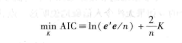
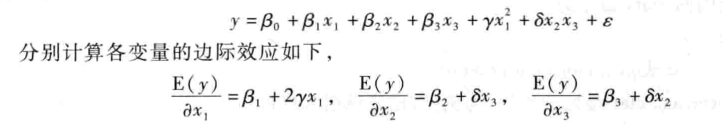

## 第九章模型设定与数据问题

### 9.1 遗漏变量

#### 1.1 定义
   + 与因变量Y相关，但是建立模型时，没有考虑的变量，而是归入了误差项  

#### 1.2 分类
   + 遗漏变量X2与已有变量X1相关，即Cov(x1,x2)≠0，在这种情况下，根据大样本理论，OLS不再是一致估计量。  
   + 遗漏变量X2与已有变量X1无关，即Cov(x1,x2)=0,在这种情况下，根据大样本理论，OLS依旧可以一致估计β1。但由于遗漏变量进入误差项，可能会增大扰动项误差，影响参数估计精度。
#### 1.3 解决办法
   + 控制变量法，加入尽可能多的***控制变量(control variable)***,即尽可能找出与被解释变量相关所有的X，无法获得变量，需要解释遗漏变量与已有解释变量无关，或者相关性弱。  
   + 使用***代理变量(proxy variable)***,使用能够代表遗漏变量的变量，比如用智商作为个人能力的代理变量(当然两者不能划等号)，理想的代理变量应满足：  
      + ***多余性***：代理变量仅通过影响遗漏变量而作用于被解释变量，即影响路径唯一。  
      + ***剩余独立性***：遗漏变量不受代理变量影响的剩余部分与所有解释变量不相关。(因为代理变量毕竟不能百分之百的代表遗漏变量，所以要求剩余部分的独立性。)     
   + 工具变量法  
   + 使用面板数据    
   + 随机试验与自然实验    

---

### 9.2无关变量
#### 9.2.1 定义
+ 与被解释变量关系无关的变量，被加入了模型的解释变量中   
#### 9.2.2 后果
+ 既然与Y无关，那么无关变量前的真实参数β应该等于0，误差项仍然保持与解释变量无相关性，OLS仍然是一致的。  
+ 引入无关变量后，会出现干扰，估计量β1方差一般会增大。  

---

### 9.3建模策略
+ 建模型是从简单模型开始，逐渐增加解释变量，还是从复杂模型开始，逐渐删除解释变量？   
+ ***应该选取折中做法***  

---

### 9.4 解释变量个数的选择 
#### 9.4.1 选取数量的标准
+ 校正可决系数  
	* 选择能最大化可决系数的解释变量个数  
+ 赤池信息准则(AIC)  

```
#stata代码
reg y x1 x2 x3
estat ic #(information criterion)

```
+ 贝叶斯信息准测(BIC)  
+ 汉南-昆信息准测(HQIC)
> 第一项是对拟合优度提升的奖励，第二项是多解释变量增加的惩罚
#### 9.4.2 选取方法
+ 通过添加或者删除解释变量使上述信息准测最小。

### 9.5 对函数形式的检验（非线性）

---

#### 9.5.1 引言
+ 很多经济关系都是非线性的，怎么通过知道是建立非线性模型还是线性模型。   
   1. 从经济理论出发，考察变量间是否有非线性关系  
   2. 通过计量检验  
+ 非线性模型的系数不再是常数，而依赖于X变量  




#### 9.5.2 检验
+ Ramesey's RESET检验：如果怀疑非线性项被遗漏了，那么就把非线性项引入方程，检验系数是否显著。  
+ 既然Y(hat)是变量X的线性估计，那么Y(hat)^2,Y(hat)^3等就依次包含了二次项与三次项的信息(包含交叉项)。那么可以构建下列方程：


然后建立假设检验，H0：δ2=δ3=δ4=0，作F检验。RESET检验在拒绝原假设的前提下，并不提供遗漏具体那些高次项。  

``` 
#stata命令
reg y x1 x2 x3
estat ovtest
estat ovtest,rhs
```

+ link test 检验