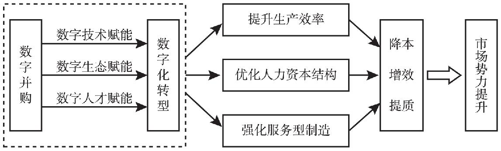

# 数字化转型的市场绩效：数字并购能提升制造业企业市场势力吗?

## 一、引言

+ **政策：**数字化转型相关政策、以及重要性

+ **困境：**数字化转型中企业面临困境、制造企业进行数字并购原因

+ **数字并购：**数字并购作为企业应对数字颠覆、实现数字化转型和发展的重要途径（两个案例，美的和工业富联）

+ **引出问题：**企业通过数字并购实现的数字化转型能否产生良好的企业绩效以帮助企业打破“数字化转型悖论，现有文献对两这关系存在分歧。

+ **创新点：** 

  + 一方面，本文基于数字并购对企业数字化转型的实质性推动，将数字并购视作企业数字化转型的正向冲击，识别出了企业数字化转型对其市场势力的影响  
  + 本文是较先明确关注数字并购对企业市场势力影响的实证文章

  

> **数字并购定义：**通过收购与自身数字化转型战略相契合的数字企业，快速且直接获得数字资产，从而增强转型能力、控制转型成本并缩短转型“阵痛期”。对于这类以数字资产为主要并购标的的并购，我们称之为“数字并购”。

## 二、理论与作用机制

## 三、

